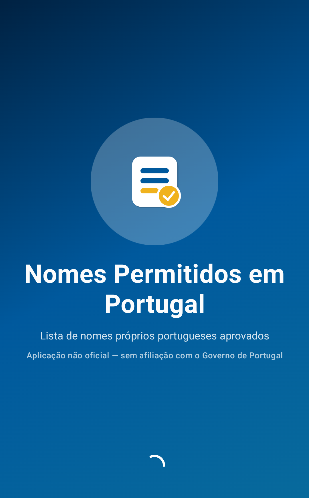
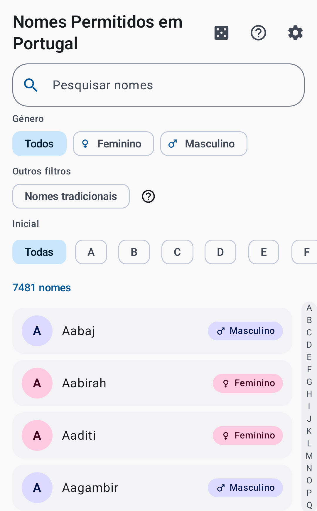
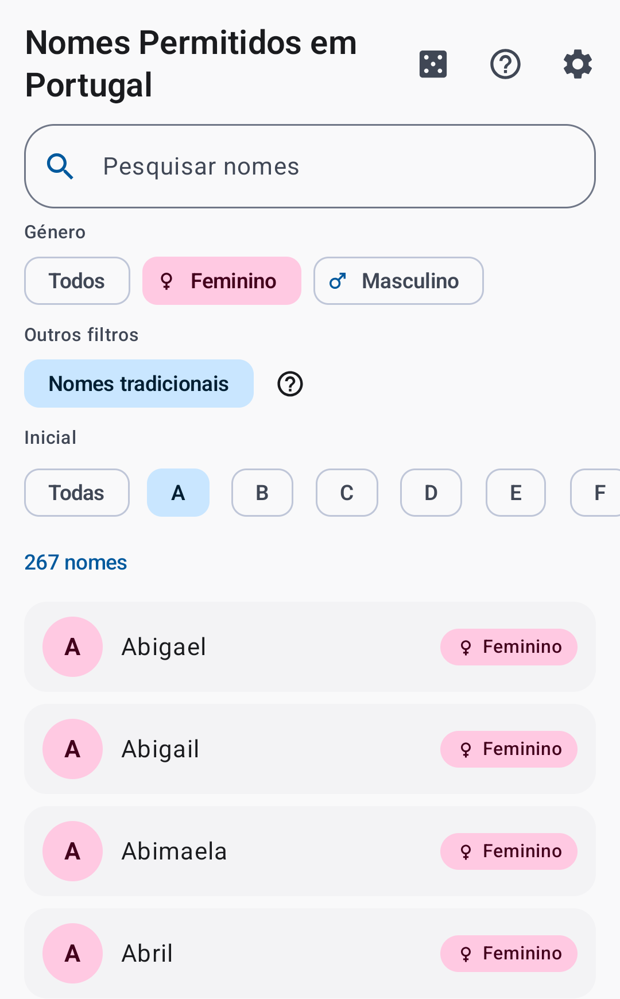
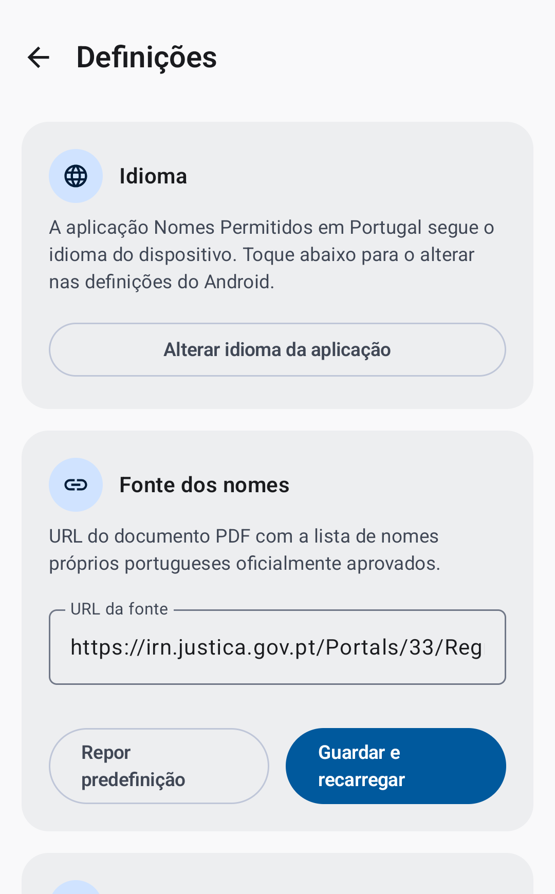

# Portugal's Approved Names (Nomes Permitidos em Portugal)

[**Open the web app**](https://nomespermitidosemportugal.neteinstein.org/) &nbsp;·&nbsp;
[**Get it on Google Play**](https://play.google.com/store/apps/details?id=org.neteinstein.pickaname)

| Splash Screen | Name List | Filtered Name List | Settings |
| :---: | :---: | :---: | :---: |
|  |  |  |  |

*Screenshots show the Portuguese (pt-PT) UI, where the app is called "Nomes Permitidos em Portugal".*

An app that lists the first names legally allowed for newborns in Portugal, based on
the official register published by the [Instituto dos Registos e do Notariado](https://irn.justica.gov.pt/en-gb/)
(IRN). Browse the full list, search it, filter it by gender, initial letter, or a best-effort
"traditional names" filter, pick a random name, look up a name's meaning, and follow links to
the official IRN rules. Available in English and Portuguese, on
[Android](https://play.google.com/store/apps/details?id=org.neteinstein.pickaname) and in the
[browser](https://nomespermitidosemportugal.neteinstein.org/).

(PT) Uma app que lista os nomes próprios permitidos para recém-nascidos em Portugal,
com base na lista oficial publicada pelo IRN. Permite consultar e pesquisar a lista completa,
filtrar por género, letra inicial ou nomes tradicionais, sortear um nome, ver o significado de
um nome e aceder às regras oficiais do IRN. Disponível para
[Android](https://play.google.com/store/apps/details?id=org.neteinstein.pickaname) e no
[browser](https://nomespermitidosemportugal.neteinstein.org/).

## Where the data comes from

The app downloads the official "Lista de Nomes Próprios" PDF published by the IRN, parses each
entry (name + allowed gender), and stores the result in a local database. The source URL is
configurable from **Settings** and defaults to the IRN's published PDF. Changing the URL (or
running the app for the first time) triggers a fresh download-and-parse pass that purges and
repopulates the database. The list is also refreshed automatically on a configurable schedule
(yearly by default).

## Architecture

MVVM + Clean Architecture, being migrated to Kotlin Multiplatform + Compose Multiplatform so
the same code can also target the web. The migration is incremental and tracked in
[MIGRATION_PLAN.md](MIGRATION_PLAN.md); today the shipping Android app (`:app`) is composed
from the extracted modules below plus the screens that haven't moved yet.

```
androidApp/         Android shell: MainActivity, manifest, launcher icons, Koin startup
core/
  model/            Plain domain models (NameEntry, Gender, RefreshPeriod, …) — no dependencies
  domain/           Repository interfaces + use cases — depends only on core:model
  designsystem/     Theme (IRN-derived palette), shared composables, shared string resources
  network/          Ktor client + remote data source for the names PDF
  datastore/        Settings repository on multiplatform-settings
  database/         Room database, DAO, and name repository
  parser/           PDF text extraction (pdfbox-android) + name list parser
  data/             Sync repository tying network + parser + database together
  testing/          Shared test utilities (e.g. MainDispatcherRule)
feature/
  settings/         Settings screen + ViewModel
composeApp/         Kotlin Multiplatform app shell (Android + wasmJs) exposing the root App()
androidApp/         Thin Android launcher for composeApp (migration scaffold, not the released app)
webApp/             wasmJs browser entry point for composeApp (published to GitHub Pages)
```

- **DI**: [Koin](https://insert-koin.io/)
- **Persistence**: [Room](https://developer.android.com/training/data-storage/room) (names) +
  [multiplatform-settings](https://github.com/russhwolf/multiplatform-settings) (settings)
- **Networking**: [Ktor](https://ktor.io/) client (CIO engine on Android)
- **UI**: Jetpack Compose / Compose Multiplatform + Navigation Compose
- **PDF parsing**: [pdfbox-android](https://github.com/TomRoush/PdfBox-Android)
- **Async**: Kotlin Coroutines & Flow

Room and pdfbox-android are Android-only for now, so the data-layer and feature modules are
still Android libraries; `composeApp` and `webApp` are the multiplatform parts (currently a
placeholder `App()` proving the Android + web pipeline). See the migration plan for what moves
next.

## Building & testing

```
./gradlew :app:assembleDebug                  # build the debug APK of the released Android app
./gradlew testDebugUnitTest                   # run the unit tests of every Android module
./gradlew lintDebug                           # run Android Lint
./gradlew :webApp:wasmJsBrowserDistribution   # build the web distribution (webApp/build/dist/wasmJs/productionExecutable)
```

The web build is deployed to GitHub Pages by `.github/workflows/deploy-web.yml`, separately
from the Android release pipeline (`release.yml`). It is served at
<https://nomespermitidosemportugal.neteinstein.org/>; the Android app is published at
<https://play.google.com/store/apps/details?id=org.neteinstein.pickaname>.

## AI agent roles

Developer, QA, Architect, and Security Manager agent definitions for both Claude Code
(`.claude/agents/`) and GitHub Copilot (`.github/agents/`) live in this repo — see
[.github/AGENT_ORCHESTRATION.md](.github/AGENT_ORCHESTRATION.md) for how delegation and
triggering work on each platform.

## Privacy

The app does not collect any personal data — see [PRIVACY_POLICY.md](PRIVACY_POLICY.md) for
details.

(PT) A app não recolhe quaisquer dados pessoais — consulte
[PRIVACY_POLICY.md](PRIVACY_POLICY.md) para mais detalhes.

## License

Copyright © 2026 Pedro Vicente. Licensed under the
[Apache License, Version 2.0](LICENSE) — see [NOTICE](NOTICE) for attribution details.
